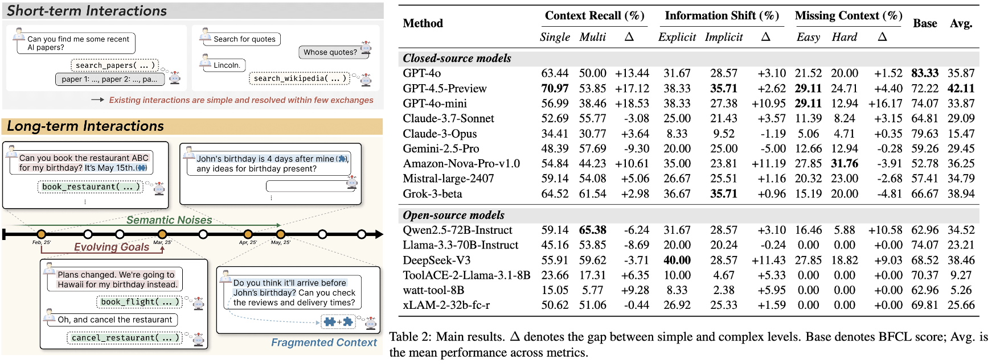

# ToolHaystack: Stress-Testing Tool-Augmented Language Models in Realistic Long-Term Interactions

ToolHaystack is the **first test suites for long-term tool utilization** featured by composable and noisy agent context. It provides three main scenarios that rigorously evaluate the necessary capabilities of TALMs in long-term interaction scenario.

**[NOTE]** The evaluation scripts and code for dataset generation pipeline will be updated soon. Stay tuned!

---

## 🚀 Overview

Recent Tool-Augmented Language Model (TALM) benchmarks have led the rapid growth of language model agents but are limited to single or short-turn scenarios. To tackle this, we propose **ToolHaystack benchmark which evaluates TALMs in a long and multi-task interleaved context** where contextual noise distracts TALMs significantly.

  

---

## Dataset: ToolHaystack

The ToolHaystack dataset is available at 🤗 huggingface(https://huggingface.co/datasets/LangAGI-Lab/ToolHaystack)

  

### Scenarios
ToolHaystack provides three main scenarios (**Context Recall, Information Shift, Missing Context**) that requires robust long-term context understanding of TALMs.

  

